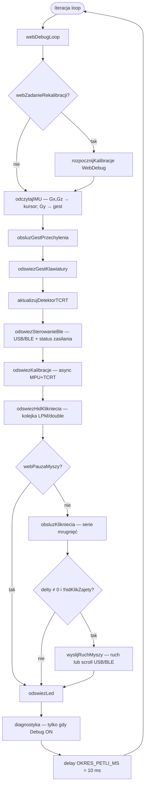
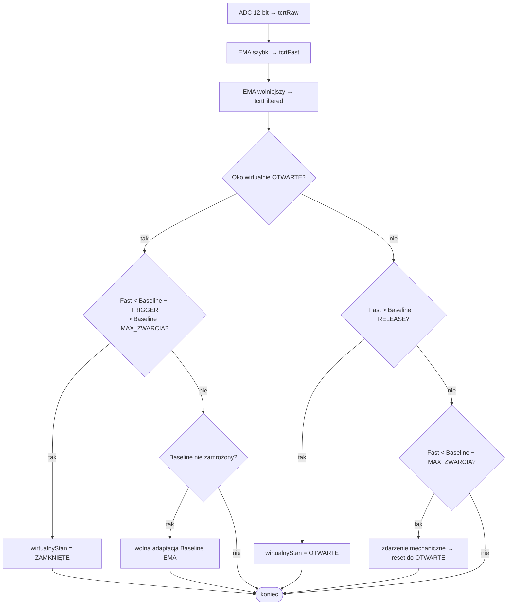
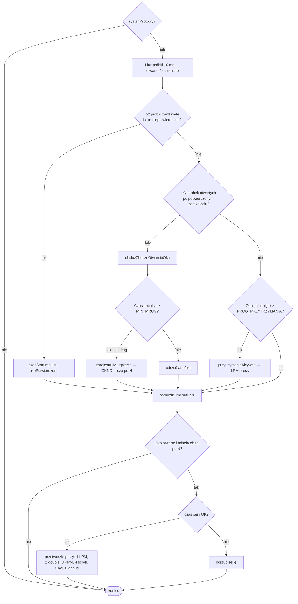

# HEFAS 4.0 — sterowanie myszką ruchem głowy

System bezdotykowej obsługi kursora myszy ruchami głowy dla osób z niepełnosprawnościami.  
**HEFAS** = Head-controlled Electronic Functional Assistive System.

Platforma: **Seeed Studio XIAO ESP32-S3 Plus** + **MPU6050** (IMU) + **TCRT5000** (mrugnięcia, sygnał analogowy) + opcjonalnie **Akyga Li-Pol 1900 mAh 1S 3,7 V** (BAT+ / BAT−).

---

## Jak to działa

### Ruch kursora (oś Gx i Gz)

- **Oś X (lewo / prawo):** prędkość kątowa **Gx** z MPU6050.
- **Oś Y (góra / dół):** prędkość kątowa **Gz** z MPU6050.
- **Oś Gy** nie steruje kursorem — wykorzystywana do **gestu przechylenia** (patrz niżej).
- Surowe odczyty → °/s przez `CZULOSC_ZYRO_LSB` (131 przy ±250°/s), minus offset z kalibracji, prog szumu i strefa martwa.
- **Rate-control:** delta HID z chwilowej prędkości, bez kumulacji pozycji (brak dryfu orientacji).
- Wzór: `dX ≈ predkosc_Gx[°/s] × CZULOSC_MYSZY (0.4)`; kierunek: `ODWROC_OS_X` / `ODWROC_OS_Y`.

### Detektor mrugnięć (TCRT5000, analogowy na A1)

1. **ADC 12-bit** → `tcrtRaw`.
2. **Dwa filtry EMA:**
   - `tcrtFast` (α = `EMA_ALPHA_SZYBKI` = 0,50) — **progi zamknięcia / otwarcia**,
   - `tcrtFiltered` (α = `EMA_ALPHA_WYSWIETLANIA` = 0,20) — logi / diagnostyka.
3. **Kalibracja async (~3 s):** 200 próbek równolegle MPU+TCRT (trimmed-mean baseline), potem ~1 s stabilizacji IR.
4. **Histereza** na `tcrtFast`: `OFFSET_TRIGGER` 320 / `OFFSET_RELEASE` 140 ADC; poniżej `OFFSET_MAX_ZWARCIA` (800) → zdarzenie mechaniczne, reset.
5. **Baseline wolny** (`EMA_ALPHA_WOLNY` = 0,003) — tylko gdy oko otwarte i **poza serią mrugnięć** (baseline zamrożony w trakcie serii).
6. **Potwierdzenie stanu:** `PROBKI_POTWIERDZENIA_STANU` = 2 (2×10 ms) zanim impuls trafi do licznika serii — anty-migotanie na progu.
7. `wirtualnyStanCzujnika` + `okoPotwierdzoneZamkniete` zasilają maszynę mrugnięć i HID.

### Gest: przechyl głowy w prawo (oś Gy)

- **Nie rusza kursora.** Wyraźne przechylenie w **prawo** (~0,28 s), próg **40 °/s**; `ODWROC_GEST_GY = -1` (nie zmieniać na 1 — u tego montażu to fizycznie prawo).
- **Akcja (tylko USB):** skrót **Ctrl + Win + O** → klawiatura ekranowa w Windows 10/11.
- Na **samym BLE** gest może się wykryć (LED), ale skrót klawiaturowy **nie jest wysyłany** (brak profilu HID Keyboard w BLE).
- Cooldown ~2,2 s między gestami.

### Mapowanie mrugnięć

Seria: kolejne mrugnięcie w tej samej serii, gdy przerwa (otwarte oko) od poprzedniego otwarcia &lt; `OKNO_MIEDZY_IMPULSAMI_MS` (600 ms). **Cisza po ostatnim impulsie** zależy od licznika: 1→350 ms, 2→450, 3→640, 4→770, 5→910, 6→1000 ms (nie wcześniejszy LPM przy szybkich 3×). Szybkie mrugnięcia blisko siebie są liczone; szum odcina `CZAS_MIN_MRUG_MS` (za krótkie zamknięcie) oraz walidacja całej serii 3× (120–1300 ms).

| Mrugnięcia | Akcja |
|------------|--------|
| 1 | **LPM** |
| 2 | **Double-click LPM** — w scrollu: **scroll OFF** (tylko wyjście) |
| 3 | **PPM** |
| 4 | **Scroll ON** (tylko gdy scroll wyłączony) |
| 5 | **Rekalibracja** MPU + TCRT (~3 s, async) |
| 6 | **Przełącznik trybu debug** (`czyDebugWlaczony`) — Serial + szczegółowe logi w WebDebug; domyślnie **wyłączony** |
| Oko zamknięte &gt; `PROG_PRZYTRZYMANIA_MS` (850 ms) | **Drag** (LPM trzymany) |

- Impulsy &lt; `CZAS_MIN_MRUG_MS` (42 ms) — odrzucone.  
- Zamknięcie **280–850 ms** — nie liczy się jako mrugnięcie (strefa przed dragiem); **&gt; 850 ms** → drag. Krótkie mrugnięcia &lt; 280 ms — jak dotąd.  
- **Scroll:** włączenie **4×**; wyłączenie przy **każdym mrugnięciu ≥2** (2× tylko OFF, 3× OFF + PPM). Mniej czuły scroll: `DZIELNIK_SCROLLA` 7, `PROG_ZYRO_SKROL_DEG_S` 3.0.  
- W trybie scrolla 1× zablokowane; drag wyłączony.

### Komunikacja HID

| Tryb | Kiedy | Co działa |
|------|--------|-----------|
| **USB** | Kabel USB-C, host widzi urządzenie (`tud_mounted`) | Mysz HID + **klawiatura HID** (skróty, gest OSK) |
| **BLE** | **Brak USB-HID** u hosta (typowo praca na ogniwie) | Mysz BLE — **reklama ON od startu** (także w kalibracji); po **5 min** bez ruchu — **uśpienie**; budzenie ruchem / mrugnięciem |

**Docelowy tryb:** ogniwo + **sparowanie BLE** — nie trzeba podłączać USB do użytkowania. Kabel USB = opcjonalnie (ładowanie, programowanie, USB-HID + klawiatura gestu). Priorytet: gdy host widzi **USB-HID**, reklama BLE jest wyłączona; po rozłączeniu od PC — BLE wraca. Mrugająca LED = **brak połączenia myszy** (sparuj BLE), nie „podłącz USB”.

**Poziom baterii w %:** firmware **nie mierzy** — na XIAO ESP32-S3 (Plus) **nie ma** podłączenia BAT+ do ADC w MCU (potwierdza [wiki Seeed – Battery Usage](https://wiki.seeedstudio.com/xiao_esp32s3_getting_started/)). Ładowanie obsługuje **osobny układ** na płytce (czerwona LED).

---

## Sprzęt i piny (XIAO ESP32-S3 Plus)

| Pin | GPIO | Funkcja |
|-----|------|---------|
| D1 / A1 | 2 | TCRT5000 **AO** |
| D4 / D5 | 5 / 6 | MPU6050 **I2C** @ 400 kHz |
| LED_BUILTIN | 21 | Status |
| BAT+ / BAT− | — | Ogniwo 1S (ładowanie z USB; **NTC z JST niepodłączać**) |
| USB-C | — | Zasilanie, programowanie, USB HID |

---

## Struktura projektu

```
HEFAS 4.0/
├── platformio.ini          seeed_xiao_esp32s3, USB HID+CDC, BLE-Mouse, MPU6050
├── include/
│   ├── hefas_config.h      Stałe strojenia
│   └── hefas_webdebug.h    WiFi AP, maski logów (WEBLOG_*)
├── src/
│   ├── main.cpp            IMU, TCRT, mrugnięcia, gest, USB/BLE
│   └── hefas_webdebug.cpp  Panel 192.168.4.1
└── README.md
```

**PlatformIO:** `ARDUINO_USB_MODE=1`, `ARDUINO_USB_CDC_ON_BOOT=1` — natywny USB (mysz + klawiatura + Serial CDC).

---

## Uruchomienie

1. MPU6050: SDA→D4, SCL→D5, 3V3, GND.  
2. TCRT5000: AO→A1, 3V3, GND (DO/LM393 nieużywane).  
3. Opcjonalnie ogniwo na BAT+ / BAT− (tylko +/−).  
4. `pio run -t upload`  
5. Przy starcie: nieruchomo, oko otwarte na TCRT ~3 s (kalibracja async, LED).  
6. 3× mrugnięcie LED = gotowość.

**Parowanie BLE (główna ścieżka):** w telefonie/PC włącz Bluetooth, szukaj **„HEFAS 4.0”** (reklama startuje po włączeniu urządzenia, bez czekania na USB). Słabe/rozładowane ogniwo może nie wystartować — to ograniczenie zasilania, nie wymóg kabla USB. Jeśli panel pokazuje **SLEEP**, porusz głową lub mrugnij.

---

## Strojenie (`include/hefas_config.h`)

### Ruch

| Parametr | Domyślnie | Opis |
|----------|-----------|------|
| `CZULOSC_MYSZY` | 0.4 | Czułość kursora |
| `STREFA_MARTWA` | 2.0 °/s | Martwa strefa |
| `PROG_ZYROSKOPU` | 1.5 °/s | Filtr szumu |

### Mrugnięcia

| Parametr | Domyślnie | Opis |
|----------|-----------|------|
| `OKNO_MIEDZY_IMPULSAMI_MS` | 600 | Max. przerwa między otwarciami w serii |
| `SERIA_CISZA_PO_1_MS` … `_6_MS` | 350…1000 | Cisza po ostatnim impulsie (zależnie od N) |
| `CZAS_REFRAKTORY_PO_IMPULSIE_MS` | 0 | Wyłączone — nie blokuje kolejnych zamknięć po impulsie |
| `SERIA_CZAS_MIN_3_MS` / `MAX_3` | 120 / 1300 | Walidacja czasu serii 3× |
| `SERIA_CZAS_MAX_4_MS` … `_6_MS` | 1900 / 2500 / 3100 | Max. czas serii 4×–6× |
| `PROG_PRZYTRZYMANIA_MS` | 850 | Drag |
| `CZAS_MIN_MRUG_MS` | 42 | Min. czas impulsu |
| `CZAS_MAX_MRUG_MS` | 280 | Powyżej → strefa drag |
| `DZIELNIK_SCROLLA` | 7 | Scroll wolniejszy |
| `PROG_ZYRO_SKROL_DEG_S` | 3.0 | Wyższy próg ruchu w scrollu |

### TCRT

| Parametr | Domyślnie |
|----------|-----------|
| `EMA_ALPHA_SZYBKI` | 0.50 |
| `EMA_ALPHA_WOLNY` | 0.003 |
| `OFFSET_TRIGGER` / `RELEASE` | 320 / 140 |

### Gest Gy

| Parametr | Domyślnie |
|----------|-----------|
| `GEST_GY_PROG_DEG_S` | 40 |
| `GEST_GY_CZAS_TRWANIA_MS` | 280 |
| `GEST_COOLDOWN_MS` | 2200 |
| `ODWROC_GEST_GY` | -1 (prawo przy tym montażu) |

### BLE

| Parametr | Domyślnie | Opis |
|----------|-----------|------|
| `CZAS_BEZCZYNNOSCI_BLE_MS` | 5 min | Po tym czasie bez aktywności — reklama BLE OFF |
| `PROG_PROBUDZENIA_BLE_DEG_S` | 12 °/s | Ruch głowy (|Gx|+|Gy|) budzi reklamę ze snu |

---

## Ogniwo, ładowanie i debug — USB ≠ ogniwo

### Jak płytka ładuje ogniwo (bez ADC w ESP32)

Na XIAO ESP32-S3 jest **układ zarządzania zasilaniem i ładowania** (Li-ion/Li-Pol z USB). **ESP32 nie musi znać procentu** — charger sam kończy ładowanie po napięciu/prądzie. Sygnalizacja:

1. Bez ogniwa, USB → czerwona LED ~30 s, potem gaśnie.  
2. Ogniwo + USB → LED **miga** (ładowanie).  
3. Pełne → LED **zgaszona**.

### Co pokazuje HEFAS (bez pomiaru napięcia)

| Kropka / pole | Znaczenie |
|---------------|-----------|
| **HID** | Host widzi mysz USB-HID (`tud_mounted()`) |
| **USB** | Kabel / 5 V (`tud_connected()` lub opcjonalnie `PIN_VBUS_ADC`) |
| **Ogn.** | Ogniwo na BAT+ (montaż — `HEFAS_OGNIOWO_ZAMONTOWANE`) |
| **Ład.** | Ogniwo + USB jednocześnie (ładowanie) |
| **BLE** (kropka) | Brak USB-HID → mysz po Bluetooth |
| **Zasil.** (panel) | Np. `Ogniwo + USB + ładowanie` lub `Ogniwo + mysz→BLE` |

**Częste mylenie:** kabel USB do ładowania ≠ mysz USB-HID (kropka USB może być zgaszona).  
Kropka **BLE** ≠ „naładowane” — tylko tryb bezprzewodowy. Rozładowane ogniwo = brak zasilania MCU, nie komunikat „podłącz USB”.

- **BLE:** reklama od startu bez USB-HID; uśpienie po 5 min; budzenie ruchem / mrugnięciem.  
- **Log `[ZAS]`** (filtr **Zasilanie**): przełączenie mysz BLE ↔ USB-HID.

**Montaż ogniwa:** BAT+ / BAT− na spodzie płytki; **NTC z 3-pinowego JST nie lutować**.

**Chcesz % w przyszłości:** zewnętrzny dzielnik napięcia na wolny pin ADC (np. D0) — patrz [FAQ Seeed – battery voltage](https://wiki.seeedstudio.com/check_battery_voltage/) (dla innych modeli XIAO; idea ta sama).

---

## WebDebug (WiFi AP)

Panel diagnostyczny działa **zawsze**, gdy `WEBDEBUG_AKTYWNY true` (niezależnie od flagi Debug). Sieć: **`HEFAS-Debug`**, hasło **`hefas1234`**, **`http://192.168.4.1`**.

### Kropki statusu (góra)

| Kropka | Znaczenie |
|--------|-----------|
| **HID** | Host widzi mysz USB-HID (`tud_mounted`) |
| **USB** | Kabel / 5 V (`tud_connected()` lub opcjonalnie `PIN_VBUS_ADC`) |
| **Ogn.** | Ogniwo na BAT+ (`HEFAS_OGNIOWO_ZAMONTOWANE`) |
| **Ład.** | Ogniwo + USB (ładowanie) |
| **Scroll** | Tryb scrolla (ruch głowy = przewijanie) |
| **Drag** | Przytrzymanie LPM (drag) |
| **Pauza** | Blokada wysyłania ruchu/klików (przycisk PAUZA) |
| **Debug** | `czyDebugWlaczony` — domyślnie **OFF**; **6× mrugnięcie** = przełącznik |
| **Oko** | Oko **potwierdzone** (liczy się do serii) |
| **BLE** | Brak USB-HID → mysz po Bluetooth |
| **Kal.** | Trwa rekalibracja MPU + TCRT (~3 s) |

### Panel boczny (liczby na żywo)

| Pole | Znaczenie |
|------|-----------|
| **L / R** | Liczniki kliknięć lewych / prawych (HID) |
| **dX / dY** | Ostatnia delta kursora |
| **SERIA** | Licznik impulsów w bieżącej serii mrugnięć |
| **cisza** | Pozostały czas do commitu akcji (zależy od N: 350…1000 ms) |
| **T** | Czas całej serii od 1. do ostatniego impulsu |
| **przerwa** | Ostatnia przerwa między otwarciami |
| **Kal.** | `TRWA ~3s` podczas kalibracji, inaczej `—` |
| **R / Fs / B** | TCRT: surowy ADC / fast (progi) / baseline |
| **V:Z / V:O, POTW** | Surowy stan progu / potwierdzenie zamknięcia |
| **Zasil.** | Skład: Ogniwo, USB-HID, USB, ładowanie, mysz→BLE |
| **BLE** | ON / SLEEP / OFF |

### Wykresy

- **Ruch głowy** — dX (czerwony), dY (cyjan); joystick = wektor chwilowy.
- **TCRT** — `tcrtFast` (progi); szare/czerwone/żółte linie = baseline / trigger / release; czerwone tło = oko potwierdzone zamknięte.

### Logi tekstowe (filtry)

Domyślnie włączone: **Mrugnięcia** (`WEBLOG_FSM`) + **Zasilanie** (`WEBLOG_BAT`). Opcjonalnie: Żyroskop, Czujnik IR, BLE/USB.

| Gdy **Debug OFF** (domyślnie) | Gdy **Debug ON** (6× mrugnięcie) |
|-------------------------------|----------------------------------|
| `[KAL] …` start/stabilizacja/gotowe (także z 5× mrugnięć) | + `[SERIA]`, `[KLIK]`, `[SCROLL]`, `[GEST]`, artefakty TCRT |
| `[DEBUG] WYLACZONY` / `WLACZONY` przy 6× | `[ZAS]`, `[TCRT]` okresowy, `[RUCH]` — według zaznaczonych filtrów |
| `[ZAS]` — jeśli filtr Zasilanie | Serial Monitor (115200) — pełne tagi |

**Kalibracja:** 5× mrugnięcie lub przycisk **REKALIBRACJA** → kropka **Kal.**, wpisy `[KAL] Start (5 mrug)` … `[KAL] Gotowe` (widoczne bez włączania Debug).

### Przyciski

- **PAUZA / WZNÓW** — blokuje ruch i kliknięcia (logika mrugnięć dalej działa).
- **REKALIBRACJA** — kalibracja MPU + TCRT (~3 s, async).
- **WYCZYŚĆ** — czyści historię logów w przeglądarce.

Wyłączenie całego AP: `WEBDEBUG_AKTYWNY false` w `hefas_config.h`.

---

## Serial Monitor (115200)

Domyślnie **`czyDebugWlaczony = false`** — po starcie Serial jest cichy (mniej obciążenia CPU). **6× mrugnięcie** włącza/wyłącza szczegółowe logi; kropka **Debug** w WebDebug odzwierciedla stan.

Przykładowe tagi (gdy Debug **ON**):

- `[KAL]` — offsety Gx, Gy, Gz, baseline TCRT  
- `[TCRT]` — Raw, Fast, Base, stan (co ~500 ms w `diagnostyka()`)  
- `[SERIA]` — commit serii (T, przerwa)  
- `[ZAS]` — zmiana trybu zasilania (filtr Zasilanie w WebDebug)  
- `[GEST]` — Ctrl+Win+O (USB)  
- `[RUCH]` / `[SCROLL]` / `[KLIK]` / `[DRAG]` / `[HID]` / `[BLE]`

Wpisy trafiają też do WebDebug zgodnie z maską filtrów (szczegóły mrugnięć/klików w panelu głównie przy **Debug ON**; `[KAL]` zawsze w filtrze Mrugnięcia).

---

## Architektura

Firmware działa **w pełni asynchronicznie** (`millis()`, bez `delay()` poza końcem iteracji). Kolejka HID obsługuje do 4 zadań kliknięć.

### Pętla główna (`loop()` @ 100 Hz)



### Detektor TCRT5000 (`aktualizujDetektorTCRT`)



Baseline jest **zamrożony** w trakcie serii mrugnięć, dragu i gdy oko zamknięte (`czyZamrozicBaselineTCRT`).

### Mrugnięcia i akcje HID (`obsluzKlikniecia`)



### Uwagi względem uproszczonego schematu (np. z generatora AI)

| Element w obcym schemacie | W HEFAS 4.0 |
|---------------------------|-------------|
| Odczyt napięcia baterii Li-Po | **Brak** — ESP32 nie mierzy %; są flagi USB-HID, kabel USB, ogniwo (montaż), ładowanie |
| Debounce „czas od zmiany TCRT” | **N próbek × 10 ms** (2 normalnie, 5 przy końcu dragu) |
| Gest Gy (Ctrl+Win+O) | Osobny blok w pętli, **nie** w ścieżce TCRT |
| Kalibracja async | `odswiezKalibracje()` co iterację; start: boot, 5× mrug, WebDebug |
| Pauza | Tylko blokuje `obsluzKlikniecia` + ruch; reszta pętli działa |
| Debug (`czyDebugWlaczony`) | Domyślnie **OFF**; **6× mrugnięcie**; wpływa na Serial i szczegółowe logi |

### Setup (skrót)

```
setup(): MPU6050 → kalibracja async → USB HID (mysz+klaw.) → webDebugInit() → BLE
```

---

## Autorzy

Bartłomiej Adamczyk, Sebastian Sobczyk  
Mechatronika — Szczecin 2026
