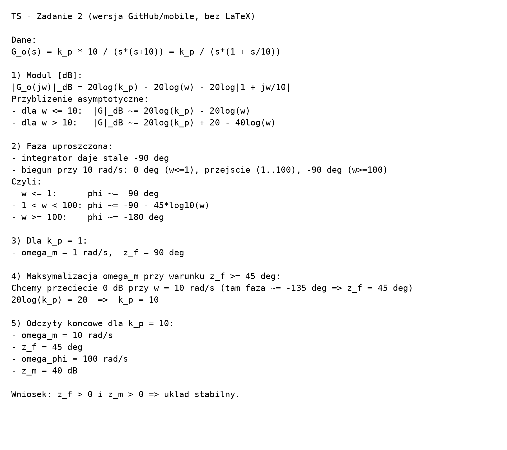
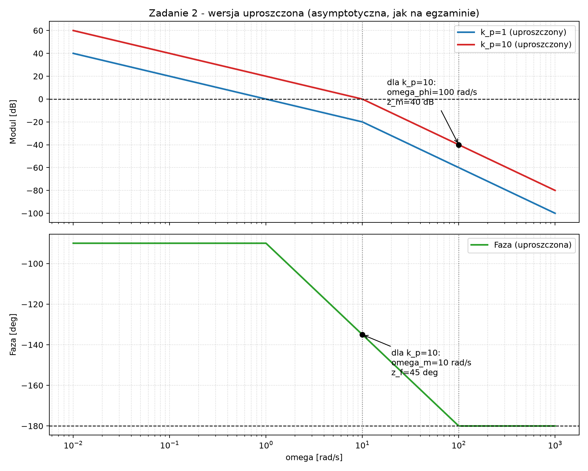

# TS — Zadanie 2 (wersja pod GitHub/iPhone)

Ta wersja NIE wymaga renderowania LaTeX.

## Równania (plain text)

- `G_o(s) = k_p * 10 / (s*(s+10)) = k_p / (s*(1 + s/10))`
- `|G_o(jw)|_dB = 20log(k_p) - 20log(w) - 20log|1 + jw/10|`
- dla `w <= 10`: `|G|_dB ~= 20log(k_p) - 20log(w)`
- dla `w > 10`: `|G|_dB ~= 20log(k_p) + 20 - 40log(w)`
- faza: `phi ~= -90 - arctg(w/10)` (uproszczona egzaminowo: od `-90` do `-180`)
- warunek doboru: `20log(k_p) = 20 => k_p = 10`
- odczyty: `omega_m = 10 rad/s`, `z_f = 45 deg`, `omega_phi = 100 rad/s`, `z_m = 40 dB`

## Obraz z równaniami (zawsze się wyświetli)

## Wykres uproszczony

