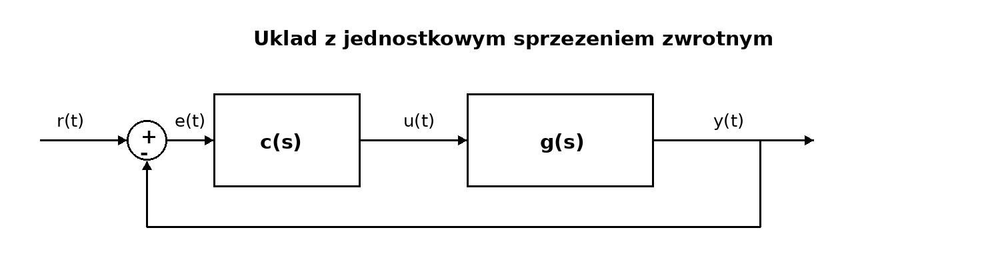
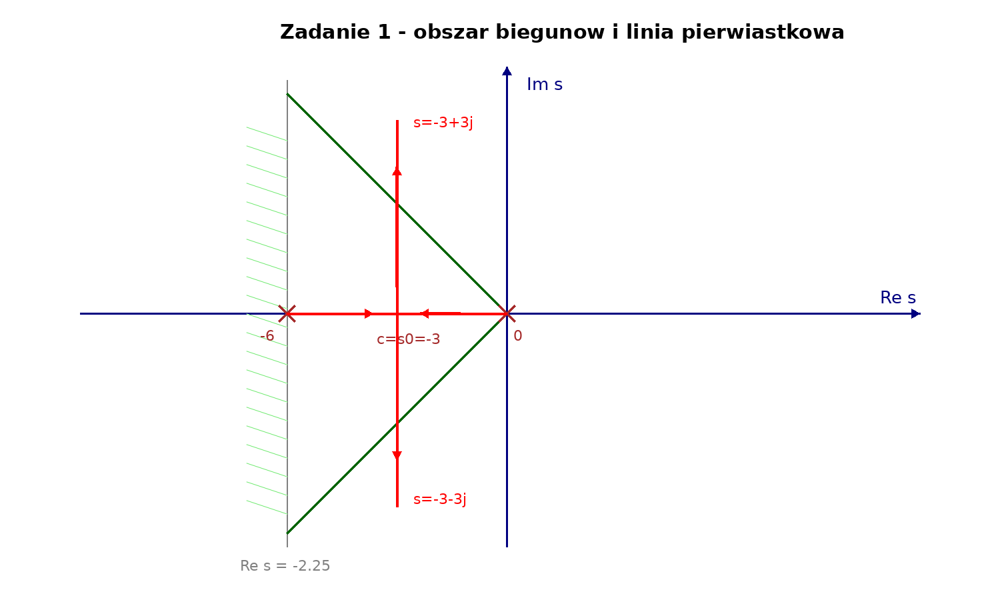
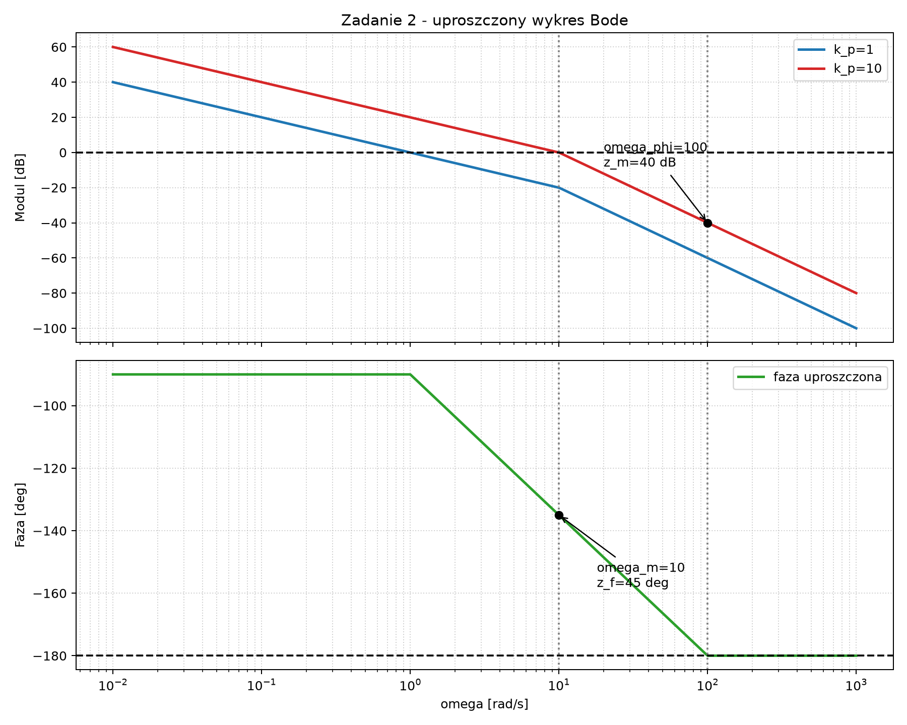
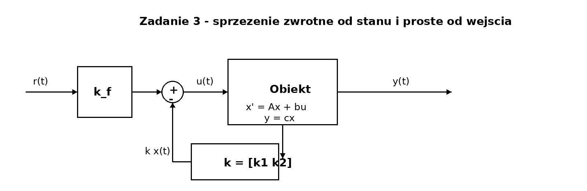
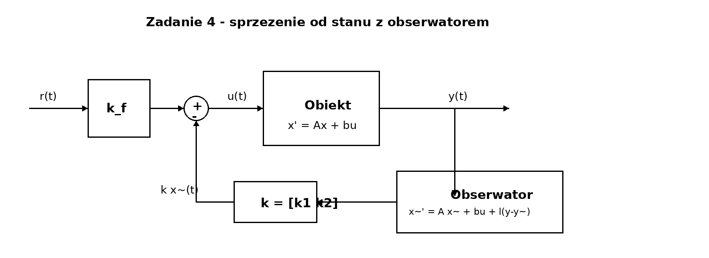

# Teoria Sterowania — przykładowy egzamin

To jest **osobny plik README**, niepowiązany z głównym projektem.

Poniżej jest kompletne rozwiązanie **wszystkich 4 zadań**, krok po kroku, w stylu egzaminowym.

---

# Zadanie 1

## Dane

Obiekt:

`g(s) = 1 / ( s * (s + 6) )`

Regulator:

`c(s) = k_p`

Układ:

Wymagania:

- stabilność,
- błąd położeniowy `e_p% <= 10%`,
- przeregulowanie `p% <= 5%`,
- czas ustalania `t_2% <= 2 s`,
- czas narastania `t_0.9` możliwie najmniejszy.

---

## Krok 1 — transmitancja zastępcza

`g_z(s) = c(s)g(s) / (1 + c(s)g(s))`

`g_z(s) = k_p * 1/(s(s+6)) / (1 + k_p * 1/(s(s+6)))`

`g_z(s) = k_p / (s^2 + 6s + k_p)`

---

## Krok 2 — stabilność wewnętrzna

Sprawdzamy układ otwarty:

`c(s)g(s) = k_p / (s(s+6))`

Nie ma upraszczających skróceń.

Mianownik układu zamkniętego:

`s^2 + 6s + k_p`

Dla układu II rzędu warunek stabilności:

- współczynnik przy `s^2` dodatni,
- współczynnik przy `s` dodatni,
- wyraz wolny dodatni.

Stąd:

`k_p > 0`

---

## Krok 3 — błąd położeniowy

`e_p = |1 - g_z(0)|`

`g_z(0) = k_p / k_p = 1`

Czyli:

`e_p = 0`

oraz:

`e_p% = 0% <= 10%`

Warunek spełniony automatycznie.

---

## Krok 4 — linia pierwiastkowa

Dla:

`g(s) = 1 / (s(s+6))`

mamy:

- zera: brak,
- bieguny: `p1 = 0`, `p2 = -6`.

Centroid:

`c = (0 + (-6)) / 2 = -3`

Asymptoty:

- liczba asymptot: `2`,
- kąty: `+90 deg` i `-90 deg`.

Punkt rozwidlenia:

`s0 = -3`

Rysunek:

---

## Krok 5 — warunki na przeregulowanie i czas ustalania

Z wykresu:

- obszar dopuszczalny dla `p% <= 5%` wyznaczają proste 45 stopni,
- warunek `t_2% <= 2 s` daje granicę `Re(s) <= -2.25`.

Z przecięć odczytujemy dwa punkty graniczne:

- `s1 = -2.25`
- `s2 = -3 + 3j`

Teraz liczymy odpowiadające im `k_p`.

Dla `s1 = -2.25`:

`k_p1 = -s(s+6)|s=-2.25`

`k_p1 = -(-2.25)(3.75) = 8.44`

Dla `s2 = -3 + 3j`:

`k_p2 = -s(s+6)|s=-3+3j`

`k_p2 = -(-3+3j)(3+3j) = 18`

Stąd:

`k_p in [8.44 , 18]`

To spełnia warunki:

- `p% <= 5%`
- `t_2% <= 2 s`

---

## Krok 6 — minimalizacja czasu narastania

Chcemy, żeby `t_0.9` był możliwie najmniejszy.

To oznacza, że wybieramy bieguny możliwie najdalej od zera, ale nadal w obszarze dopuszczalnym.

Czyli wybieramy punkt:

`s = -3 + 3j`

co daje:

`k_p = 18`

---

## Odpowiedź do zadania 1

`k_p = 18`

Układ spełnia:

- stabilność,
- `e_p = 0`,
- `p% <= 5%`,
- `t_2% <= 2 s`,
- `t_0.9` możliwie najmniejszy.

---

# Zadanie 2

## Dane

Obiekt:

`g(s) = 10 / ( s * (s + 10) )`

Regulator:

`c(s) = k_p`

Układ:

Wymagania:

- stabilność,
- błąd położeniowy `e_p% <= 10%`,
- zapas fazy `z_f >= 45 deg`,
- modułowa pulsacja przejścia `omega_m` możliwie największa.

---

## Krok 1 — transmitancja układu otwartego

`g_o(s) = c(s)g(s)`

`g_o(s) = k_p * 10 / ( s * (s + 10) )`

Po uproszczeniu:

`g_o(s) = k_p / ( s * (1 + s/10) )`

---

## Krok 2 — błąd położeniowy

Układ ma biegun w zerze, więc jest typu I.

Dlatego:

`e_p = 0`

oraz:

`e_p% = 0% <= 10%`

---

## Krok 3 — charakterystyka częstotliwościowa

Podstawiamy:

`s = j*omega`

Wtedy:

`g_o(j*omega) = k_p / ( j*omega * (1 + 0.1*j*omega) )`

Moduł:

`|g_o(j*omega)| = k_p / ( omega * sqrt(1 + (0.1*omega)^2 ) )`

Faza:

`phi(omega) = -90 deg - arctg(0.1*omega)`

---

## Krok 4 — wykres uproszczony Bodego

Rysunek:

Dla `k_p = 1` odczytujemy:

- `omega_m = 1 rad/s`
- `z_f = 90 deg`

Ponieważ zapas fazy jest duży, możemy zwiększać `k_p`.

---

## Krok 5 — maksymalizacja omega_m

Chcemy, aby punkt przecięcia z osią `0 dB` przesunął się jak najbardziej w prawo, ale tak, żeby nadal:

`z_f >= 45 deg`

Z uproszczonego wykresu widać, że graniczny punkt wypada przy:

`omega_m = 10 rad/s`

bo wtedy:

`phi(10) = -135 deg`

czyli:

`z_f = 45 deg`

---

## Krok 6 — wyznaczenie k_p

Aby przesunąć moduł o `20 dB` do góry:

`20log(k_p) = 20`

Stąd:

`k_p = 10`

---

## Krok 7 — odczyt parametrów końcowych

Dla `k_p = 10`:

- `omega_m = 10 rad/s`
- `z_f = 45 deg`
- `omega_phi = 100 rad/s`
- `z_m = 40 dB`

Ponieważ:

- `z_f > 0`
- `z_m > 0`

układ jest stabilny.

---

## Odpowiedź do zadania 2

`k_p = 10`

Końcowe parametry:

- `omega_m = 10 rad/s`
- `z_f = 45 deg`
- `omega_phi = 100 rad/s`
- `z_m = 40 dB`

---

# Zadanie 3

## Dane

Równanie obiektu:

`y''(t) + y(t) = u(t)`

Układ sterowania:

Wymagania:

- stabilność wewnętrzna,
- `e_p = 0`,
- `p% <= 5%`,
- `t_2% <= 1 s`.

---

## Krok 1 — transmitancja obiektu

Przechodzimy do Laplace'a przy zerowych warunkach początkowych:

`s^2 Y(s) + Y(s) = U(s)`

Stąd:

`g(s) = Y(s)/U(s) = 1 / (s^2 + 1)`

Bieguny:

- `p1 = +j`
- `p2 = -j`

Układ otwarty nie jest asymptotycznie stabilny.

---

## Krok 2 — realizacja w przestrzeni stanu

Przyjmujemy zmienne stanu:

- `x1 = y`
- `x2 = y'`

Wtedy:

- `x1' = x2`
- `x2' = -x1 + u`
- `y = x1`

Macierze:

`A = [ [0, 1], [-1, 0] ]`

`b = [ [0], [1] ]`

`c = [1, 0]`

`d = 0`

---

## Krok 3 — sterowalność i obserwowalność

Macierz sterowalności:

`W = [ b  Ab ]`

`W = [ [0, 1], [1, 0] ]`

`det(W) = -1 != 0`

Układ jest sterowalny.

Macierz obserwowalności:

`V = [ c ; cA ]`

`V = [ [1, 0], [0, 1] ]`

`det(V) = 1 != 0`

Układ jest obserwowalny.

---

## Krok 4 — wybór biegunów układu zamkniętego

Z warunków `p% <= 5%` i `t_2% <= 1 s` wybieramy:

- `p_bar1 = -5`
- `p_bar2 = -10`

Czyli oczekiwany mianownik:

`(s + 5)(s + 10) = s^2 + 15s + 50`

---

## Krok 5 — sprzężenie zwrotne od stanu

Przyjmujemy:

`u(t) = -k*x(t) + k_f*r(t)`

gdzie:

`k = [k1  k2]`

Macierz układu zamkniętego:

`A - b*k`

Wyznaczamy mianownik:

`det(sI - A + bk) = s^2 + k2*s + 1 + k1`

Porównujemy z:

`s^2 + 15s + 50`

Stąd:

- `k2 = 15`
- `1 + k1 = 50`

czyli:

- `k1 = 49`

Ostatecznie:

`k = [49  15]`

---

## Krok 6 — wyznaczenie k_f

Warunek:

`e_p = 0`

czyli:

`g_k(0) = 1`

Mamy:

`g_k(s) = k_f / (s^2 + 15s + 50)`

Zatem:

`g_k(0) = k_f / 50 = 1`

stąd:

`k_f = 50`

---

## Krok 7 — transmitancja końcowa

`g_k(s) = 50 / (s^2 + 15s + 50)`

czyli:

`g_k(s) = 50 / ((s+5)(s+10))`

---

## Krok 8 — stabilność wewnętrzna

Wartości własne macierzy `A - bk`:

- `lambda1 = -5`
- `lambda2 = -10`

Obie mają ujemne części rzeczywiste.

Układ jest stabilny wewnętrznie.

---

## Odpowiedź do zadania 3

`k = [49  15]`

`k_f = 50`

`g_k(s) = 50 / ((s+5)(s+10))`

Prawo sterowania:

`u(t) = -49*x1(t) - 15*x2(t) + 50*r(t)`

---

# Zadanie 4

## Dane

Równanie obiektu:

`y''(t) = u(t)`

Układ sterowania:

Wymagania:

- stabilność wewnętrzna,
- `e_p = 0`,
- `p% <= 5%`,
- `t_2% <= 1 s`.

---

## Krok 1 — transmitancja obiektu

Po Laplace'ie:

`s^2 Y(s) = U(s)`

czyli:

`g(s) = 1 / s^2`

Bieguny:

- `p1 = 0`
- `p2 = 0`

Układ otwarty jest niestabilny.

---

## Krok 2 — model stanu

Przyjmujemy:

- `x1 = y`
- `x2 = y'`

Wtedy:

- `x1' = x2`
- `x2' = u`
- `y = x1`

Macierze:

`A = [ [0, 1], [0, 0] ]`

`b = [ [0], [1] ]`

`c = [1, 0]`

`d = 0`

Układ jest:

- sterowalny,
- obserwowalny.

---

## Krok 3 — najpierw zakładamy, że stan jest dostępny

Dobieramy bieguny układu zamkniętego:

- `p_bar1 = -10`
- `p_bar2 = -10`

Zatem:

`(s + 10)^2 = s^2 + 20s + 100`

Liczymy:

`det(sI - A + bk) = s^2 + k2*s + k1`

Porównujemy współczynniki:

- `k2 = 20`
- `k1 = 100`

Czyli:

`k = [100  20]`

---

## Krok 4 — wyznaczenie k_f

Warunek:

`e_p = 0`

czyli:

`g_k(0) = 1`

Mamy:

`g_k(s) = k_f / (s^2 + 20s + 100)`

Zatem:

`g_k(0) = k_f / 100 = 1`

Stąd:

`k_f = 100`

Końcowa transmitancja dla dostępnego stanu:

`g_k(s) = 100 / (s+10)^2`

---

## Krok 5 — projekt obserwatora

Stan dokładny nie jest dostępny, więc używamy obserwatora:

`x_tilde' = A*x_tilde + b*u + l*(y - y_tilde)`

`y_tilde = c*x_tilde`

Przyjmujemy:

`l = [l1  l2]^T`

Dobieramy bieguny obserwatora:

- `mu1 = -5`
- `mu2 = -5`

Czyli:

`(mu + 5)^2 = mu^2 + 10mu + 25`

Liczymy:

`det(mu*I - A + l*c) = mu^2 + l1*mu + l2`

Porównujemy współczynniki:

- `l1 = 10`
- `l2 = 25`

Czyli:

`l = [10  25]^T`

---

## Krok 6 — sterowanie z obserwatorem

Prawo sterowania:

`u(t) = -k*x_tilde(t) + k_f*r(t)`

gdzie:

- `k = [100  20]`
- `k_f = 100`

---

## Krok 7 — transmitancja końcowa

Dzięki zasadzie separacji transmitancja zastępcza układu sterowania jest taka sama jak dla przypadku z dokładnie dostępnym stanem:

`g_z(s) = 100 / (s+10)^2`

---

## Krok 8 — stabilność wewnętrzna

Wartości własne całego układu rozszerzonego:

- z regulatora: `-10`, `-10`
- z obserwatora: `-5`, `-5`

Wszystkie mają ujemne części rzeczywiste.

Układ jest stabilny wewnętrznie.

---

## Odpowiedź do zadania 4

`k = [100  20]`

`k_f = 100`

`l = [10  25]^T`

`g_z(s) = 100 / (s+10)^2`

Prawo sterowania:

`u(t) = -k*x_tilde(t) + k_f*r(t)`

---

# Odpowiedzi końcowe — wszystko w jednym miejscu

## Zadanie 1

`k_p = 18`

## Zadanie 2

`k_p = 10`

`omega_m = 10 rad/s`

`z_f = 45 deg`

`omega_phi = 100 rad/s`

`z_m = 40 dB`

## Zadanie 3

`k = [49  15]`

`k_f = 50`

`g_k(s) = 50 / ((s+5)(s+10))`

## Zadanie 4

`k = [100  20]`

`k_f = 100`

`l = [10  25]^T`

`g_z(s) = 100 / (s+10)^2`
